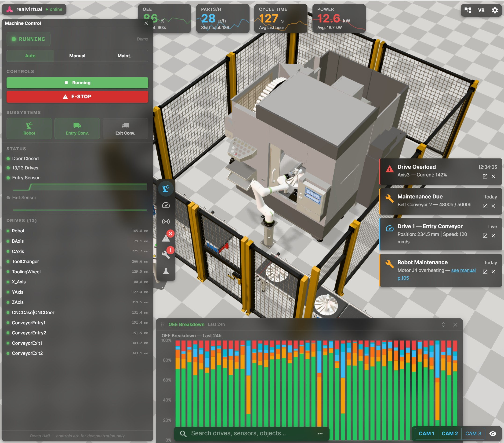
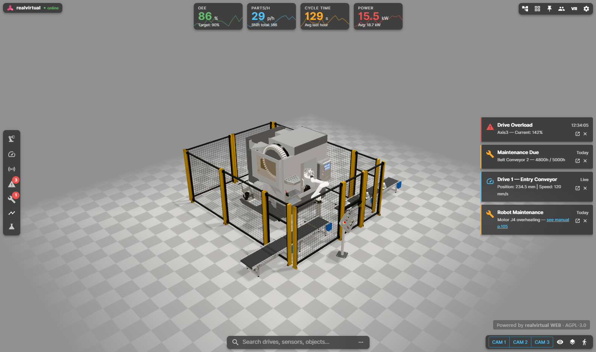
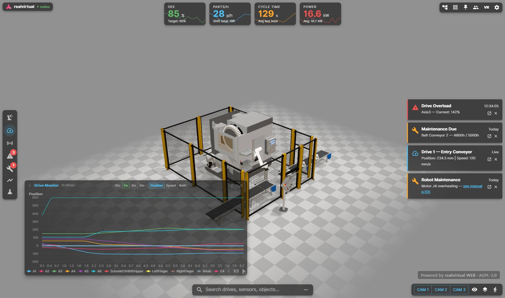
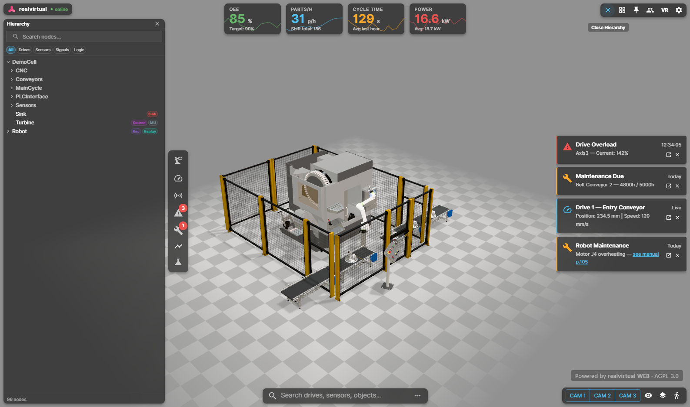
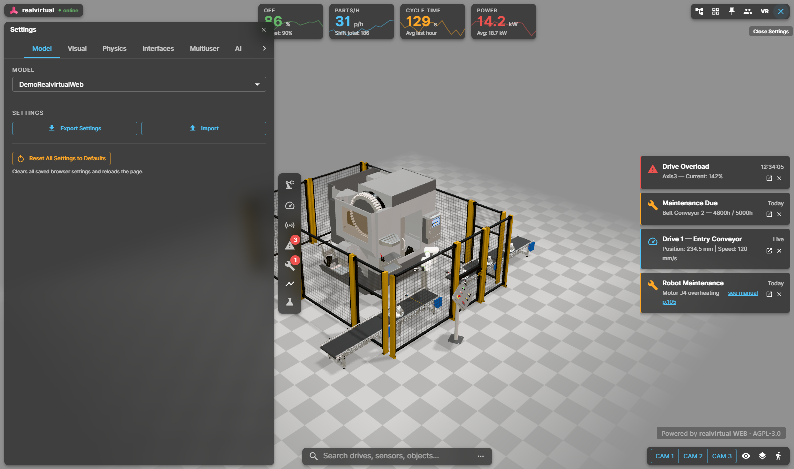

# realvirtual WEB

**Browser-Based 3D HMI, Machine Information System, and Digital Twin Viewer for Industrial Automation**

[](https://www.gnu.org/licenses/agpl-3.0)
[](https://www.typescriptlang.org/)
[](https://threejs.org/)
[](https://github.com/game4automation/realvirtual-MCP)



realvirtual WEB is an open-source, browser-based 3D HMI and digital twin viewer for manufacturing. Load any standard GLB/glTF file and view it as an interactive 3D model in the browser. For full digital twin functionality — drives, sensors, transport simulation, signal wiring, and KPI dashboards — use GLB files enriched with `rv_extras` metadata, either exported from [realvirtual.io](https://realvirtual.io) Professional or authored manually. No installation required.

**One link. Any device. Live Digital Twin.** Try it: [web.realvirtual.io/demo](https://web.realvirtual.io/demo)

> Part of the [realvirtual.io](https://realvirtual.io) industrial digital twin platform — a [Unity Verified Solution](https://unity.com/partners/realvirtual) for virtual commissioning, 3D HMI, and simulation.

## What It Does

realvirtual WEB replaces traditional desktop HMI and SCADA visualization with a modern, browser-based 3D experience. Connect to real PLCs via WebSocket or MQTT, and operators see live machine states — drive positions, sensor readings, alarms, KPIs — all in the context of the machine's 3D layout. Unlike flat panel HMIs, operators see *what* is happening, *where* it is happening, and *why*.

### Key Capabilities

- **Live 3D HMI** — Real-time PLC signal visualization via WebSocket or MQTT. Drive monitoring, sensor states, KPI overlays, alarm dashboards, and production charts powered by [Apache ECharts](https://echarts.apache.org/).
- **Machine Information System** — Attach documents, maintenance guides, technical drawings, and manuals directly to 3D components. Technicians click a part and see its documentation in context — accessible from any device on the shop floor.
- **Transport Simulation** — Full in-browser simulation engine at 60 Hz fixed timestep: conveyor surfaces, sources, sinks, sensors with AABB collision, grippers, and material flow.
- **LogicStep Sequencing** — Serial/parallel containers, signal conditions, delays, drive commands — ported from realvirtual.io Professional based on Unity.
- **WebXR (VR/AR)** — Immersive visualization on Meta Quest, Apple Vision Pro, and AR on Android/iOS with surface detection.
- **Multiuser Sessions** *(Beta)* — Real-time collaboration with avatars, shared camera views, role management, and late-join state sync.
- **Plugin Architecture** — Extend with custom plugins for project-specific HMI, KPI dashboards, maintenance workflows, and industrial interfaces.
- **Microsoft Teams Integration** *(Beta)* — Embed interactive 3D digital twins directly in Teams meetings and channels.
- **AI-Ready (MCP)** — Built-in [Model Context Protocol](https://modelcontextprotocol.io) bridge lets AI assistants like Claude inspect, control, and debug the running viewer — read drive states, set signals, query scene hierarchy, and automate testing through natural language. Uses the [realvirtual MCP Server](https://github.com/game4automation/realvirtual-MCP).

## Use Cases

### 3D HMI / Operator Dashboards
Web-based HMI connected to real PLCs via WebSocket or MQTT. Live signal visualization, KPI overlays, drive monitoring — replacing desktop HMI applications with a browser link.



### Machine Information System
Attach PDFs, maintenance guides, technical drawings, operating manuals, and spare part lists directly to individual 3D components. Technicians open a link on their tablet, click on a motor or valve, and immediately see its documentation, maintenance history, and real-time status — all in 3D context, on-site or remotely. No more searching through binders or file shares.

### Sales & Product Presentation
Interactive 3D models that let prospects explore machines live in the browser. More convincing than slides, more accessible than installed software. Share a link — done.

### Product Configurators
Build browser-based 3D product configurators where customers select options, variants, and accessories — and see the result rendered in real time. Combine with the plugin system to add pricing, BOM generation, or quote workflows.

### Training & Onboarding
Operators learn machine behavior interactively before touching the real system. No software installation, no VPN, no IT department required.

### Remote Acceptance & Support
Share virtual commissioning models with customers for review and sign-off — worldwide, instantly.

## Quick Start

```bash
# Requirements: Node.js >= 20.19 or >= 22.12
# Clone the repository (increase buffer for large GLB model files)
git config --global http.postBuffer 524288000
git clone https://github.com/game4automation/realvirtual-WEB.git
cd realvirtual-WEB

npm install
npm run dev          # Vite dev server with HMR
```

Drop `.glb` files exported from [realvirtual.io](https://realvirtual.io) into `public/models/` — they appear automatically in the model selector.

```bash
npm run build        # Production build -> dist/
npm run preview      # Preview production build
npm test             # Run all tests (headless Chromium via Playwright)
```

## Operating Modes

| Mode | Description |
|------|-------------|
| **Standalone** | Pure browser simulation — no Unity, no PLC. Fixed-timestep physics loop runs the full digital twin offline. |
| **Live** | Connected via WebSocket — a bridge application translates non-WebSocket-capable industrial protocols (OPC UA, S7, ADS, etc.) to the browser. *(Upcoming)* |
| **Direct** | Direct REST/MQTT connection to PLC without Unity in the loop. |

## Deployment Options

- **Public Demo** — Publish to `web.realvirtual.io` for sales demos and marketing
- **Private Projects** — Unguessable URLs with 128-bit entropy for secure customer access
- **Self-Hosted** — Deploy on your own infrastructure with `settings.json` configuration
- **Kiosk Mode** — Lock all configuration UI for shopfloor panels and public displays

## Tech Stack

| Component | Technology |
|-----------|-----------|
| 3D Rendering | [Three.js](https://threejs.org/) (WebGL + WebGPU *(Beta)* + WebXR) |
| Physics | [Rapier.js](https://rapier.rs/) (WASM) *(Beta)* |
| UI Framework | React 19 + MUI 7 |
| Charts | Apache ECharts 5 |
| Build Tool | Vite 6 |
| Language | TypeScript 5.7 |
| Testing | Vitest (browser-mode) + Playwright |

## Industrial Connectivity

Connect to real automation systems via:

| Protocol | Description |
|----------|-------------|
| **WebSocket Realtime** | Bidirectional PLC signal streaming (primary live mode) |
| **MQTT** | IoT and cloud connectivity |
| **Bosch Rexroth ctrlX** | Direct ctrlX CORE integration |
| **REST API** | Polling-based signal access |

The Unity-side [realvirtual.io Professional](https://realvirtual.io) supports 15+ industrial protocols including Siemens S7, Beckhoff ADS, OPC UA, Fanuc, KUKA, ABB, EtherNet/IP, Modbus, and more — all bridged to the browser via WebSocket.

## Architecture

realvirtual WEB works with **any standard GLB/glTF file** — load a CAD export from Blender, SolidWorks, Fusion 360, or any other 3D tool and view it as an interactive 3D model in the browser.

For full digital twin functionality, the GLB file becomes the single source of truth: signal bindings, kinematic definitions, drive parameters, sensor thresholds, and component metadata are embedded via the `rv_extras` schema. [realvirtual.io Professional](https://realvirtual.io) provides the authoring tools to add this metadata during Unity export, but the `rv_extras` format is open and documented — you can author it with any toolchain.

```
src/
  core/
    engine/          # Simulation engine (drives, sensors, transport, physics)
    hmi/             # React HMI components (panels, tooltips, settings)
  hooks/             # React hooks
  interfaces/        # Industrial protocol adapters (WebSocket, MQTT, ctrlX)
  plugins/           # Built-in plugins (multiuser, annotations, FPV, XR)
    demo/            # Demo charts and HMI (OEE, cycle time, energy, drive/sensor overlays)
    models/          # Per-model plugins (auto-loaded when a model is selected)
tests/               # Vitest browser-mode tests
e2e/                 # Playwright E2E tests
public/models/       # GLB model files
```

## Extending realvirtual WEB

Plugins can contribute UI components to predefined **slots** in the HMI layout — KPI bar, button panel, message panel, settings tabs, and more. The built-in demo plugin uses all of these:







The plugin system makes it easy to add custom functionality. Create a plugin class and register it with `viewer.use()`:

```typescript
import type { RVViewerPlugin } from './core/rv-plugin';
import type { RVViewer } from './core/rv-viewer';

class MyPlugin implements RVViewerPlugin {
  id = 'my-plugin';

  install(viewer: RVViewer) {
    // Access drives, signals, scene — all from the viewer API
    viewer.on('model-loaded', () => {
      const drives = viewer.drives;          // all drives in the scene
      const signals = viewer.signalStore;    // PLC signal store
      console.log(`Model loaded with ${drives.length} drives`);
    });
  }
}

// Register in main.ts or a model-specific plugin module
viewer.use(new MyPlugin());
```

**Per-model plugins** load automatically when a specific GLB is selected. Place them in `src/plugins/models/<ModelName>/index.ts`:

```typescript
export const models = ['MyMachine'];  // matches MyMachine.glb

export function registerModelPlugins(viewer) {
  viewer.use(new MyCustomDashboard());
}

export function unregisterModelPlugins(viewer) {
  viewer.removePlugin('my-dashboard');
}
```

For the full plugin API — UI slots, event bus, hooks, context menus, and tooltip extensions — see [doc-extending-webviewer.md](doc-extending-webviewer.md).

## Documentation

| Document | Contents |
|----------|----------|
| [Unity Export Guide](https://doc.realvirtual.io/extensions/realvirtual-web) | GLB export from Unity, publish workflow, WebViewer Tools (Pro) |
| [Architecture](doc-webviewer.md) | Full architecture, component reference, configuration |
| [Plugin Development](doc-extending-webviewer.md) | Plugin system, custom components, UI slots, hooks |
| [Multiuser System](doc-multiuser-system.md) | Sessions, shared views, avatars *(Beta)* |
| [Debugging Guide](doc-web-debugging.md) | Debugging tools and workflow |
| [Industrial Interfaces](doc-webviewer-interface.md) | WebSocket Realtime, ctrlX, MQTT, signal flow, implementing new interfaces |

## AI-Enabled Development (MCP)

realvirtual WEB and [realvirtual.io](https://realvirtual.io) are fully AI-enabled through the **Model Context Protocol (MCP)**. AI coding assistants like [Claude Code](https://claude.ai/code) can directly interact with both the Unity Editor and the running realvirtual WEB instance:

The [**realvirtual MCP Server**](https://github.com/game4automation/realvirtual-MCP) is the recommended AI bridge. It connects AI assistants to:

- **realvirtual WEB** — List drives and positions, read/write PLC signals, query the scene hierarchy, inspect sensor states, debug transport simulation — all from the running browser scene.
- **Unity Editor** *(optional)* — When used with [realvirtual.io](https://realvirtual.io), 80+ additional tools are available: create GameObjects, set component properties, run simulations, manage scenes, take screenshots, and run tests.

This means AI assistants can design, build, test, and debug industrial digital twins end-to-end.

### Getting Started with AI Development

This repo includes a full [Claude Code](https://claude.ai/code) setup:

- **[CLAUDE.md](CLAUDE.md)** — Project conventions, architecture overview, and coding guidelines for AI assistants
- **[.claude/commands/](.claude/commands/)** — Slash commands for common workflows: `/dev`, `/debug`, `/test`, `/build`, `/inspect`, `/license-check`
- **[webviewer.mcp.md](webviewer.mcp.md)** — MCP tools reference for browser-side scene inspection

Open this project in Claude Code and use `/dev` to start the dev server, `/debug drives` to inspect drive states, or `/test` to run the full test suite — all through natural language.

## The Two-Platform Strategy

realvirtual.io follows a deliberate two-platform architecture:

| | Unity (Engineering Platform) | realvirtual WEB (Delivery Platform) |
|---|---|---|
| **Purpose** | CAD import, behavior modeling, virtual commissioning | Browser-based 3D HMI, monitoring, collaboration |
| **Technology** | Unity Engine, C#, Unity Industry | Three.js, TypeScript, React |
| **Deployment** | Desktop application, XR headsets, mobile devices | Any modern browser |
| **PLC connection** | Native protocol drivers | WebSocket / MQTT gateway |
| **Target user** | Automation engineer, simulation expert | Operator, service tech, sales, customer |

## License

Copyright (C) 2025 [realvirtual GmbH](https://realvirtual.io)

This program is licensed under the **GNU Affero General Public License v3 (AGPL-3.0)**.

**What this means:** If you use, modify, or build upon realvirtual WEB in your own project — including deploying it as a web service — you must publish your **complete project** under the same AGPL-3.0 license and make it freely available. This includes all source code, configuration, and **all content delivered through the application** (such as GLB model files, settings, and plugins). This applies whether served over a network or distributed directly.

The "Powered by realvirtual WEB" watermark and the realvirtual logo must remain visible and unmodified in all AGPL deployments. Removal or modification of any branding requires a commercial license.

See [LICENSE](LICENSE) for the full license text.

**SPDX-License-Identifier:** `AGPL-3.0-only`

### Commercial License

If you want to use realvirtual WEB in proprietary or closed-source products — or keep your 3D models, project configuration, and plugins private — a commercial license is available.

Contact: [realvirtual.io/en/company/license](https://realvirtual.io/en/company/license)

---

**[realvirtual.io](https://realvirtual.io)** | [Live Demo](https://web.realvirtual.io/demo) | [Documentation](https://doc.realvirtual.io) | [YouTube](https://youtube.com/@realvirtualio) | [Forum](https://forum.realvirtual.io)
