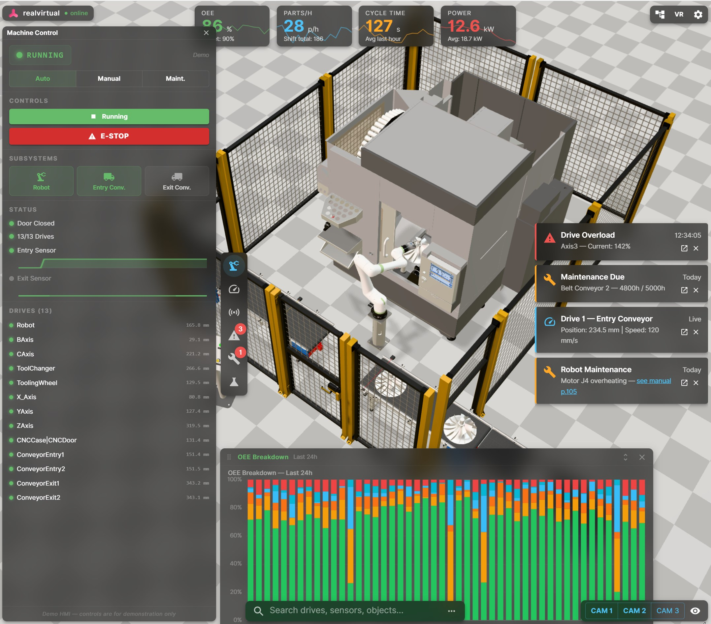
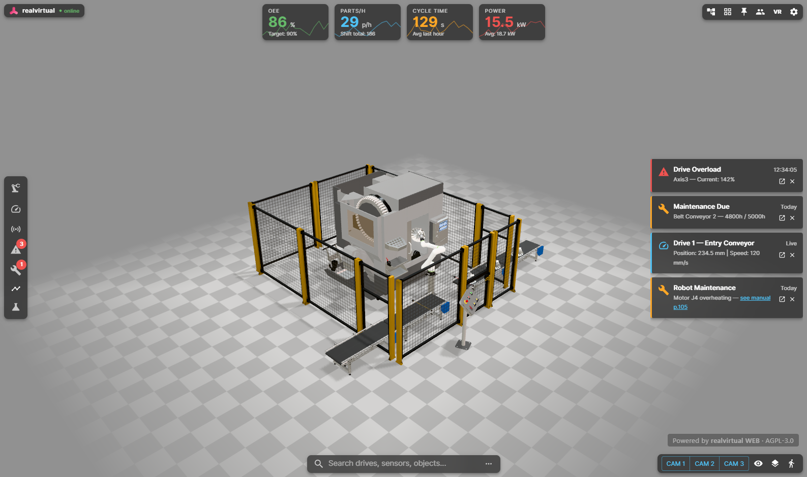
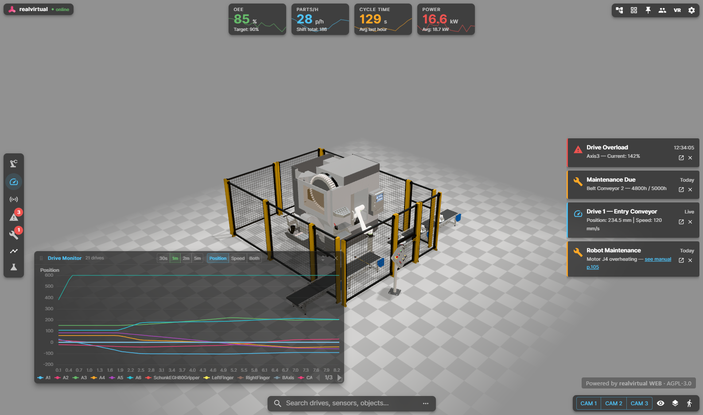
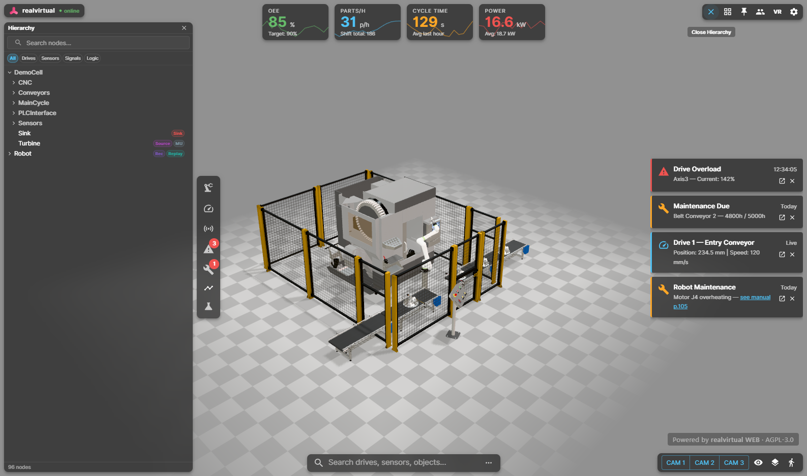
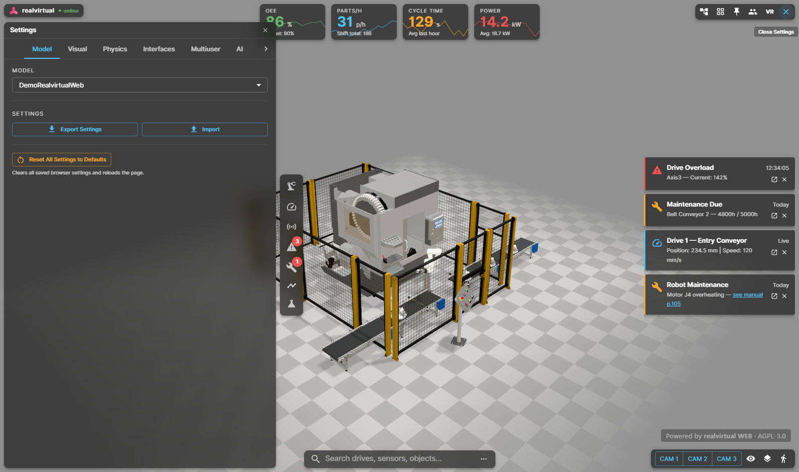

# realvirtual

**The browser platform for industrial digital twins — 3D HMI, Machine Information System, simulation and layout planning**

[](https://www.gnu.org/licenses/agpl-3.0)
[](https://www.typescriptlang.org/)
[](https://threejs.org/)
[](doc-ai-integration.md)



realvirtual (formerly *realvirtual WEB*) is an open-source, browser-based 3D HMI and digital twin platform for manufacturing. Open GLB/glTF models in the browser, simulate drives and material flow, connect machine signals, and build operator dashboards. Simulation components use `rv_extras` metadata, which you can export from [realvirtual for Unity](https://realvirtual.io) Professional or author with your own tools. Viewers need no desktop installation; developers can build the Community application with Node.js.

**One link. Any device. Live Digital Twin.** Try it: [web.realvirtual.io/demo](https://web.realvirtual.io/demo)

This repository is the **Community edition** under AGPL. It includes the viewer, HMI, transport simulation and layout planner. Browser asset authoring, CAD import and additional simulation modules are commercial extensions. See [Community Edition vs. Commercial](#community-edition-vs-commercial).

> Made by [realvirtual GmbH](https://realvirtual.io). realvirtual runs in the browser; [realvirtual for Unity](https://realvirtual.io) — a [Unity Verified Solution](https://unity.com/partners/realvirtual) — is the option for Unity developers and native builds.

## What It Does

realvirtual replaces traditional desktop HMI and SCADA visualization with a modern, browser-based 3D experience. Connect real PLCs and robot controllers through [realvirtual CONNECT](#industrial-connectivity), and operators see live machine states — drive positions, sensor readings, alarms, KPIs — all in the context of the machine's 3D layout. Unlike flat panel HMIs, operators see *what* is happening, *where* it is happening, and *why*.

### Key Capabilities

- **Workspace Modes** — Viewer for presentation, HMI for operation, Planner for layouts, and Commissioning for commissioning workflows. DES and Editor require the corresponding commercial modules. Select a workspace from the toolbar or use `?mode=viewer`, `hmi`, `planner`, `commissioning`, `des` or `editor`; selecting a mode does not install its required features.
- **Live 3D HMI** — Real-time PLC signal visualization. Machines connect through realvirtual CONNECT — Siemens S7, TwinCAT ADS, OPC UA, EtherNet/IP, Modbus, MQTT, ctrlX, robot controllers and more. Drive monitoring, sensor states, KPI overlays, alarm dashboards, and production charts powered by [Apache ECharts](https://echarts.apache.org/).
- **Signal Linking by Drag & Drop** — Drag a live interface signal straight onto a component slot (Forward, TargetSpeed, SensorOccupied, …). Direction and value type are checked, connections are saved with the layout, and signals can be monitored and forced.
- **Collision Detection** — Give a node one of six collision roles (Tool, Workpiece, Machine, Robot, Environment, None); while the simulation runs, every pair of bodies with *different* roles is checked against each other.
- **Machine Information System** — Attach documents, maintenance guides, technical drawings, and manuals directly to 3D components. Technicians click a part and see its documentation in context — accessible from any device on the shop floor.
- **Transport Simulation** — Full in-browser simulation engine at 60 Hz fixed timestep: conveyor surfaces, sources, sinks, sensors with AABB collision, grippers, and material flow.
- **LogicStep Sequencing** — Serial/parallel containers, signal conditions, delays, drive commands — ported from realvirtual for Unity Professional.
- **WebXR (VR/AR)** — Immersive visualization in compatible WebXR browsers and devices. VR, AR and surface detection depend on browser and device capabilities.
- **Layout Planning** *(Beta)* — Assemble factory layouts directly in the browser: drag reusable parts from a library onto a grid, connect them with typed snap points, and position them with transform gizmos. Ships with a standard parts library and can load any GLB catalog straight from a GitHub repository.
- **Multiuser Sessions** *(Beta)* — Real-time collaboration with avatars, shared camera views, role management, and late-join state sync.
- **Plugin Architecture** — Extend with custom plugins for project-specific HMI, KPI dashboards, maintenance workflows, and industrial interfaces.
- **AI-Ready (MCP)** — Let an AI assistant inspect drives, read and write signals, query the scene and debug simulation through the browser MCP bridge. Connect through the separately installed realvirtual CONNECT gateway or the Node development fallback; see [AI setup](doc-ai-integration.md).

## Community Edition vs. Commercial

This repository is the **community edition** of realvirtual. It contains the complete viewer and HMI runtime under AGPL-3.0 and builds and runs entirely on its own — the commercial extension modules resolve to no-op stubs (`src/private-stubs/`), so the corresponding features are simply absent from a public build.

**Included in this repository (AGPL):** the full 3D viewer and HMI runtime — GLB loading with `rv_extras` parsing, the transport simulation engine (drives, sensors, sources/sinks, grippers, LogicSteps), signal store with WebSocket / MQTT / ctrlX / REST interfaces, drag & drop signal linking, collision detection, machine information system, layout planner *(Beta)*, multiuser sessions *(Beta)*, WebXR, the plugin system, and the MCP bridge.

**Commercial extensions (not part of this repository):**

| Feature | Description |
|---|---|
| **Asset & Kinematics Editor** | Browser authoring: group parts, assign materials, create drives and save GLBs. Community loads geometry and supported components from these models; components requiring commercial solvers still need those modules. |
| **CAD Import** | STEP, JT, USD, FBX and Onshape import providers. Setup and conversion requirements depend on the provider; these providers are absent from Community. |
| **Robot IK Solver** *(Beta)* | Inverse kinematics for robot models. |
| **Kinematic Mechanisms** *(Beta)* | Closed-loop mechanism solver (cranks, couplers, parallel kinematics). |
| **Machining Simulation** *(Beta)* | CSG-based material removal. |
| **DES Simulation Kernel** *(Beta)* | Discrete-event simulation for the DES workspace. |
| **Virtual PLC** *(Beta)* | Browser PLC programming and execution; see [Virtual PLC](doc-plc-programming.md). Live signal connectivity in Community is a separate capability. |
| **Physics** *(Beta)* | Physics-based simulation behavior. |
| **Smooth Motion** | Motion smoothing and interpolation. |

**Explore the hosted demo:** [web.realvirtual.io/demo](https://web.realvirtual.io/demo) can include commercial extensions that are absent from this repository. Available modules and evaluation limits depend on the deployed build and license. A local Community build does not gain those modules by opening the same model.

Two related commercial products complete the platform and are separate from this repository:

- **[realvirtual for Unity — Professional](https://realvirtual.io)** — the Unity runtime for Unity developers and native builds (.exe, Linux, XR); it exports `rv_extras`-enriched GLBs and bridges 15+ native industrial protocols (Siemens S7, Beckhoff ADS, OPC UA, and more).
- **[realvirtual CONNECT](https://realvirtual.io/doc/web/connect/overview/)** — the gateway that makes Live mode work (industrial protocols → WebSocket) and hosts the built-in MCP server.

A commercial license additionally allows proprietary/closed-source use, keeping your models and configuration private, and removal or replacement of the realvirtual branding — see [License](#license).

## Use Cases

### 3D HMI / Operator Dashboards
Web-based HMI connected to real PLCs through realvirtual CONNECT. Live signal visualization, KPI overlays, drive monitoring — replacing desktop HMI applications with a browser link.



### Machine Information System
Attach PDFs, maintenance guides, technical drawings, operating manuals, and spare part lists directly to individual 3D components. Technicians open a link on their tablet, click on a motor or valve, and immediately see its documentation, maintenance history, and real-time status — all in 3D context, on-site or remotely. No more searching through binders or file shares.

### Sales & Product Presentation
Interactive 3D models that let prospects explore machines live in the browser. More convincing than slides, more accessible than installed software. Share a link — done.

### Product Configurators
Build browser-based 3D product configurators where customers select options, variants, and accessories — and see the result rendered in real time. Combine with the plugin system to add pricing, BOM generation, or quote workflows.

### Layout Planning
Assemble factory layouts directly in the browser — drag conveyors, robots, fixtures, and pallets from a parts library onto a grid, connect them with typed snap points, and arrange them with transform gizmos. Ships with a standard parts library, and can additionally load GLB catalogs from a URL or GitHub repository.


**Try it live:** Open the [public demo](https://web.realvirtual.io/demo) and choose **Layout planning** on the welcome screen.

### Training & Onboarding
Operators learn machine behavior interactively before touching the real system. No software installation, no VPN, no IT department required.

### Remote Acceptance & Support
Share virtual commissioning models with customers for review and sign-off — worldwide, instantly.

## Quick Start

```bash
# Use Node.js 22 or 24 LTS
# Clone the standalone Community repository
git clone https://github.com/game4automation/realvirtual-WEB.git
cd realvirtual-WEB

npm ci
npm run dev          # Vite dev server with HMR
```

Load your own model in one of three ways — there is no folder that gets scanned:

- **Import it in the app** — open the import dialog and choose the **GLB File** tab, then drop `.glb` files or pick them from disk. Files stay in your browser; nothing is uploaded.
- **Link to it** — `?glb=https://host/your-model.glb` loads a GLB from any host you control (GitHub raw, a CDN, your own server). Nothing is uploaded and no sign-in is needed.
- **Put it in a project** — a project declares what it holds in its own `project.json` (`documents[]`), and that manifest is the single source of truth. The bundled demo in `public/demo-realvirtual/` is a working example. This is the path a delivered project uses: it keeps its documents in the project itself (root-level, `models/`, `library/` — the folder is a place, not a type).

```bash
npm run build        # Production build -> dist/ (local only, nothing published)
npm run preview      # Preview production build
npx tsc --noEmit     # Type check (community view)
npx playwright install chromium  # Install the browser before browser tests
npm test             # Run browser tests (headless Chromium via Playwright)
npm run test:node    # Run Node.js tests (fs, glob, ESLint instance)
npm run test:all     # Run both Node + browser tests
npm run build:embed  # Build the embed app required by the E2E preview server
npm run e2e          # Run Playwright end-to-end tests (e2e/)
npm run lint         # ESLint (flat-config, boundaries rule)
```

**Type checking:** plain `npx tsc --noEmit` is the **community view** — the base `tsconfig.json`
excludes the generated list of private-dependent tests (`tests/private-dependent-tests.json`), so it
type-checks exactly what a clone of this repository actually contains. `npm run typecheck` is the
*maintainer* full check: it uses `tsconfig.full.json` and **requires the private sibling repository**
`../realvirtual-WebViewer-Private~`, which is not part of this repository — running it without that
folder produces a wall of unresolvable `@rv-private/*` errors. Use `npx tsc --noEmit`.

Publishing is maintainer-only: `npm run deploy` uploads to realvirtual's own Bunny CDN
(`web.realvirtual.io`) and needs `BUNNY_*` credentials that ship with no clone. To host a build
yourself, serve the `dist/` folder produced by `npm run build` from any static web server — see
[doc-deploy.md](doc-deploy.md) for the deployment details.

## Operating Modes

| Mode | Description |
|------|-------------|
| **Standalone** | Pure browser simulation — no gateway, no PLC. The fixed-timestep simulation loop runs the full digital twin offline. |
| **Live** | Connected to a **realvirtual CONNECT** gateway over WebSocket — CONNECT talks to the PLC and streams signals into the browser in real time. This is the usual arrangement for PLC protocols (OPC UA, S7, ADS, Modbus, …), because the browser cannot speak them directly. |
| **Direct** | The browser connects straight to the equipment over a browser-capable protocol (MQTT over WebSocket, REST) — no gateway in the loop. |

**realvirtual CONNECT** is the gateway that makes Live mode work: it speaks the industrial
protocols a browser cannot, and hands the signals to the browser over one WebSocket. It is a
separate product and is documented at
[realvirtual.io/doc/web/connect](https://realvirtual.io/doc/web/connect/overview/) — this repository holds
only the browser side of the contract (see [doc-webviewer-interface.md](doc-webviewer-interface.md)).

## Deployment Options

- **Self-hosted application** — Build with `npm run build` and serve `dist/` from your own static host. See [hosting and deployment](doc-deploy.md).
- **Embedded viewer** — Build with `npm run build:embed` and integrate the custom element or lightweight viewer API into your site.
- **Project delivery** — Keep `project.json`, models, attachments and compiled plugins together. See [persistence](doc-persistence.md).
- **Kiosk display** — Hide configuration controls for shop-floor panels. Configure access restrictions on your hosting infrastructure; a hidden control or an unguessable link is not authentication.

Publishing to realvirtual's hosted demo uses maintainer credentials and infrastructure.

## Tech Stack

| Component | Technology |
|-----------|-----------|
| 3D Rendering | [Three.js](https://threejs.org/) (WebGL + WebGPU *(Beta)* + WebXR) |
| UI Framework | React 19 + MUI 7 |
| Charts | Apache ECharts 6 |
| Build Tool | Vite 6 |
| Language | TypeScript 5.9 |
| Testing | Vitest (browser-mode) + Playwright |

## Industrial Connectivity

**Machines connect through [realvirtual CONNECT](https://realvirtual.io/en/products/connect).** CONNECT is a native gateway that runs next to the machine (IPC or edge PC). It speaks the controllers' own protocols and streams every signal into the browser over one WebSocket (the openly documented WebSocket Realtime v2 protocol). Interfaces are configured and monitored in the browser, signal by signal. The free CONNECT tier covers all interfaces with up to 20 signals.

| Category | Interfaces in realvirtual CONNECT |
|----------|-----------------------------------|
| **PLCs** | Siemens S7 (S7-300/400/1200/1500) · Siemens PLCSIM Advanced (native API) · Beckhoff TwinCAT ADS · OPC UA · EtherNet/IP (Allen-Bradley, Omron) · Modbus TCP client and server · Bosch Rexroth ctrlX (native Data Layer or bridge) · Keba Kemro X · Festo AX / Phoenix Contact PLCnext |
| **IoT** | MQTT — topics, Siemens process image, flat JSON (SEW MOVI-C) |
| **Robots** | FANUC (RoboGuide / Robot-IF) · Denso (b-CAP / WinCaps VRC) · ABB RobotStudio |
| **Simulation** | Siemens SIMIT (shared memory) |

Full list with addressing and settings: [CONNECT interfaces](https://realvirtual.io/doc/web/connect/interfaces/protocols/).

**Without a gateway**, the browser can also connect directly to equipment that speaks a browser-capable protocol:

| Interface | Description |
|-----------|-------------|
| **WebSocket Realtime v2** | Your own bridge or server speaking the open realvirtual protocol |
| **MQTT over WebSocket** | Brokers that offer a WebSocket listener |
| **Bosch Rexroth ctrlX** | ctrlX CORE through the realvirtual bridge snap |
| **REST API** | Polling-based signal access |

[realvirtual for Unity](https://realvirtual.io) Professional has its own 25+ interfaces that run inside Unity — no separate gateway is needed there.

## Architecture

realvirtual loads GLB/glTF geometry from compatible exporters. See [Quick Start](#quick-start) for the loading options.

The GLB stores model geometry and `rv_extras` metadata such as signal bindings, drives and sensors. The project manifest (`project.json`) identifies documents and their plugin bindings; attachments and compiled project plugins can be separate files. Keep these together when delivering a project. [realvirtual for Unity](https://realvirtual.io) Professional can export enriched GLBs, and the metadata format is also documented for other toolchains.

```
src/
  core/
    engine/          # Simulation engine (drives, sensors, transport)
    hmi/             # React HMI components (panels, tooltips, settings)
  hooks/             # React hooks
  interfaces/        # Industrial protocol adapters (WebSocket, MQTT, ctrlX)
  plugins/           # Built-in plugins (multiuser, annotations, FPV, XR)
    demo/            # Demo charts and HMI (OEE, cycle time, energy, drive/sensor overlays)
    models/          # Built-in model plugin packs compiled into the application
  private-stubs/     # No-op stubs for commercial modules — what makes this community
                     #   edition build and run without the private sibling repository
  embed/             # Lightweight embedding entry points
tests/               # Vitest browser and Node tests
e2e/                 # Playwright E2E tests
public/demo-realvirtual/  # Bundled demo project: its GLBs and its project.json manifest
```

## Extending realvirtual

Plugins can contribute UI components to predefined **slots** in the HMI layout — KPI bar, button panel, message panel, settings tabs, and more. The built-in demo plugin uses all of these:







For a project-specific extension, bind a TypeScript module to a document through `documents[].scriptRef` in the project manifest:

```json
{
  "id": "doc_triangle_dkqhmg",
  "name": "Community triangle",
  "path": "triangle.glb",
  "scriptRef": "plugins/counter.ts"
}
```

The module exports paired `registerModelPlugins` and `unregisterModelPlugins` functions that register its plugins with `viewer.use()` and clean them up again. Compile the project's scripts with `npm run build:project-scripts -- <project-folder>`, open the project folder in the application and allow its native project code after reviewing it. Distribute the compiled `.js` alongside the `.ts` source and manifest.

Built-in model plugin packs under `src/plugins/models/` are compiled into the application. Use project `scriptRef` bindings for extensions that should travel with a project. For JavaScript behaviors stored inside a GLB, see [Component Scripting](doc-scripting.md).

For the full plugin API — UI slots, event bus, hooks, context menus, and tooltip extensions — see [doc-extending-webviewer.md](doc-extending-webviewer.md).

## Documentation

End users start at the **[realvirtual documentation site](https://realvirtual.io/doc/web/)**.
Developers start with **[Architecture](doc-webviewer.md)**. The full in-repo documentation set:

**Getting started & architecture**

| Document | Contents |
|----------|----------|
| [Architecture](doc-webviewer.md) | Full architecture, component reference, configuration, workspace modes |
| [AGV and fleet control](doc-path-fleet-control.md) | Paths, tasks, docking and project control |
| [Virtual PLC (commercial beta)](doc-plc-programming.md) | Requires an enabled commercial build; not in Community |
| [From Unity to the Web](doc-unity-to-web.md) | Porting patterns and the AI coding-agent workflow |
| [Lifecycle](doc-lifecycle.md) | Runtime lifecycle: model load, fixed-step loop, pause, reset, dispose, events |
| [Node Paths](doc-node-paths.md) | How component, signal and kinematic references are written and resolved |

**Building & extending**

| Document | Contents |
|----------|----------|
| [Plugin Development](doc-extending-webviewer.md) | Plugin system, custom components, UI slots, hooks |
| [Events & Hooks](doc-events-and-hooks.md) | Typed event bus and plugin/component lifecycle hooks |
| [Component Behaviors](doc-behaviors.md) | Per-node TypeScript behaviors and naming conventions |
| [Component Scripting](doc-scripting.md) | JavaScript behaviors authored inside the GLB, run in a QuickJS sandbox |
| [Behavior Modelling](doc-behavior-modelling.md) | Continuous vs DES material-flow modelling (beginner's guide) |
| [Signal Architecture](doc-signal-architecture.md) | Signal store: GLB import to React UI, PLC direction, batching |
| [Signal Connection Logic](doc-signal-connection-logic.md) | Slots, connection states, drag & drop linking, forcing, persistence |
| [UI Visibility](doc-ui-visibility.md) | Which axis decides what is shown: plugin modes vs. UI visibility rules |

**Authoring & operations**

| Document | Contents |
|----------|----------|
| [Layout Planner](doc-layout-planner.md) | Library objects, catalogs, snap points, pivots, deep-links |
| [Persistence](doc-persistence.md) | Document model, GLB drafts, autosave, recovery and storage backends |
| [Document Linking](doc-document-linking.md) | PDF/AASX datasheet linking and metadata |

**Connectivity & collaboration**

| Document | Contents |
|----------|----------|
| [Industrial Interfaces](doc-webviewer-interface.md) | WebSocket Realtime, ctrlX, MQTT, signal flow, new-interface guide |
| [Multiuser System](doc-multiuser-system.md) | Sessions, shared views, avatars |
| [AI Integration](doc-ai-integration.md) | AI integration and the MCP bridge |
| [MCP Tools](webviewer.mcp.md) | MCP tools reference (read state, set signals, build layouts) |

**Deploy & debug**

| Document | Contents |
|----------|----------|
| [Building & Deploying](doc-deploy.md) | Community self-hosting and separate maintainer publishing workflows |
| [Debugging Guide](doc-web-debugging.md) | Debugging tools, debug API, E2E tests, workflow |

## AI-Enabled Development (MCP)

realvirtual and realvirtual for Unity are fully AI-enabled through the **Model Context Protocol (MCP)**. AI coding assistants like [Claude Code](https://claude.ai/code) can drive the running scene directly.

**[realvirtual CONNECT](https://realvirtual.io/doc/web/connect/overview/) is a separate installation** and the default MCP host. Once installed and configured, it exposes `http://localhost:5100/mcp`; the browser bridge connects to CONNECT to make the `web_*` tools available. A local Node bridge is also supported for development. Follow [AI Integration](doc-ai-integration.md) for setup, registration requirements and troubleshooting.

- **realvirtual (browser)** — list drives and positions, read/write PLC signals, query the scene
  hierarchy, inspect sensor states, debug transport simulation, take screenshots of the running
  scene.
- **Unity Editor** *(optional)* — with [realvirtual for Unity](https://realvirtual.io) Professional, the
  separate realvirtual MCP package adds 80+ editor tools: create GameObjects, set component
  properties, run simulations, manage scenes, run tests.

This means AI assistants can design, build, test, and debug industrial digital twins end-to-end.

### Getting Started with AI Development

This repo includes guidance for AI coding assistants such as [Claude Code](https://claude.ai/code):

- **[CLAUDE.md](CLAUDE.md)** — Project conventions, architecture overview, and coding guidelines for AI assistants
- **[webviewer.mcp.md](webviewer.mcp.md)** — MCP tools reference for browser-side scene inspection

Open this project in Claude Code, start the dev server and connect the MCP bridge as described in [AI Integration](doc-ai-integration.md) — then inspect drives, signals and the scene through natural language.

## One Platform, Two Runtimes

realvirtual is the browser platform and the default way to work. Both runtimes share the same data — GLB files with `rv_extras` — and connect to machines through realvirtual CONNECT.

| | realvirtual (browser) | realvirtual for Unity |
|---|---|---|
| **For** | Drag & drop users and everyone building 3D HMIs, Machine Information Systems or their own web apps | Unity developers and teams that need native builds |
| **Scope** | 3D HMI, Machine Information System, simulation, layout planning, collaboration; commercial asset authoring, CAD import and DES | Engineering in the Unity Editor, virtual commissioning, native protocol drivers |
| **Technology** | Three.js, TypeScript, React | Unity Engine, C# |
| **Deployment** | Any modern browser | Desktop (.exe, Linux), XR headsets, mobile |
| **PLC connection** | realvirtual CONNECT gateway, or direct WebSocket, MQTT over WebSocket and REST | Native protocol drivers |

## Contributing

Contributions are welcome. Please note that realvirtual is **dual-licensed**
(AGPL-3.0-only + commercial): by submitting a pull request or any other
contribution, you agree to the grant of rights described in
[CONTRIBUTING.md](CONTRIBUTING.md), which allows realvirtual GmbH to also
license your contribution under its commercial license.

## License

Copyright (C) 2025–2026 [realvirtual GmbH](https://realvirtual.io)

This program is licensed under the **GNU Affero General Public License v3 (AGPL-3.0)**.

**What this means:** If you use, modify, or build upon realvirtual in your own project — including deploying it as a web service — the AGPL-3.0 requires you to make the corresponding source of your work available to its users under the same license. realvirtual GmbH considers everything delivered through the application part of that work: source code, plugins, configuration and content such as GLB model files and settings. If you want to keep any of this private, use a commercial license.

The realvirtual branding — the realvirtual logo and the "powered by realvirtual" badge — stays visible and unmodified in AGPL deployments. Removing or replacing the branding requires a commercial license.

See [LICENSE](LICENSE) for the full license text.

**SPDX-License-Identifier:** `AGPL-3.0-only`

### Commercial License

If you want to use realvirtual in proprietary or closed-source products — or keep your 3D models, project configuration, and plugins private — a commercial license is available.

Contact: [realvirtual.io/en/company/license](https://realvirtual.io/en/company/license)

---

**[realvirtual.io](https://realvirtual.io)** | [Live Demo](https://web.realvirtual.io/demo) | [realvirtual Documentation](https://realvirtual.io/doc/web/) | [realvirtual for Unity Documentation](https://doc.realvirtual.io) | [YouTube](https://youtube.com/@realvirtualio) | [Forum](https://forum.realvirtual.io)
